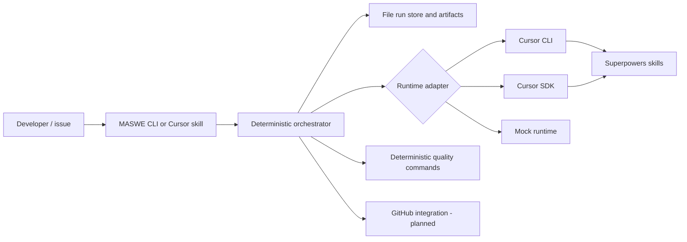

# Cursor Multi-Agent Software Engineer

A durable, model-configurable software delivery orchestrator for Cursor and the Superpowers methodology.

The system separates product discovery, specification, implementation, independent verification, and pull-request comment resolution into distinct roles. A deterministic state machine owns stage transitions and file-based artifacts preserve every handoff.

> Project status: **v0.1 foundation**. The local CLI, workflow state machine, artifact store, Cursor CLI adapter, optional Cursor SDK adapter, quality gates, read-only checks, tests, and Cursor plugin skill are implemented. Native GitHub App automation and a hosted control plane are designed but intentionally scheduled for later milestones.

## Why this exists

Long agent conversations drift. Builders can overfit to their own implementation, model selection can silently change, and PR comments can broaden scope. This project makes the process explicit:

```text
request
  -> brainstormer
  -> human approval
  -> specification/design agent
  -> human approval
  -> builder
  -> deterministic CI
  -> independent verifier
  -> PR review
  -> scoped resolver
  -> deterministic CI
  -> fresh verifier
  -> merge ready
```

Superpowers supplies the engineering practices inside each stage. MASWE supplies durable orchestration, model routing, gates, artifacts, retries, and policy enforcement.

## Default roles

| Role | Preferred default | Permissions | Responsibility |
|---|---|---|---|
| Brainstormer | Grok 4.5 | Read-only | Product discovery, alternatives, risks, acceptance criteria |
| Designer | Claude Fable 5; Opus 4.8 fallback | Read-only | PRD-quality specification, architecture, test and implementation plan |
| Builder | Grok 4.5 | Workspace write | TDD-oriented implementation of the approved plan |
| Verifier | GPT-5.6 Sol High | Read-only | Independent evidence-based verification |
| PR resolver | GPT-5.6 Sol High | Scoped workspace write | Minimal resolution of in-scope review comments |

Model identifiers in Cursor can change and may differ by plan. The starter config contains the intended defaults as initial slugs. Run `agent models` and `maswe doctor`, then adjust the exact values available to your account.

## Architecture at a glance



The architecture deliberately keeps the Cursor plugin thin. The standalone orchestrator is the source of truth so a workflow can survive editor restarts, model failures, CI runs, and multi-day PR review.

## Quick start

### Prerequisites

- Node.js 22.15 or newer.
- Git.
- Cursor CLI installed and authenticated when using the default runtime.
- Superpowers installed in Cursor with `/add-plugin superpowers`.
- A clean target repository, unless `policy.allowDirtyWorkspace` is explicitly enabled.

### Install and build

```bash
git clone https://github.com/tomazb/cursor-multi-agent-software-engineer.git
cd cursor-multi-agent-software-engineer
npm install
npm run check
npm run build
npm link
```

`npm link` makes the `maswe` command available globally for local development. A packaged release can replace this later.

### Initialize a target repository

```bash
cd /path/to/your-project
maswe init
```

This creates `.maswe/config.json`. Edit its models and quality commands for the project, then validate the environment:

```bash
agent models
maswe doctor
```

### Start a feature

```bash
maswe start \
  --title "Add organization audit trail" \
  --request-file docs/requests/organization-audit-trail.md
```

The brainstormer runs and the workflow stops at the first approval gate. Inspect the generated artifact under `.maswe/runs/<run-id>/artifacts/`.

```bash
maswe approve <run-id> brainstorm
maswe approve <run-id> design
```

The second approval executes the builder, configured quality commands, and a fresh verifier. A successful run stops at `PR_READY`.

```bash
maswe pr-opened <run-id>
maswe review-comment <run-id> --text "Please add the missing expired-token case."
# In-scope changes return to PR_REVIEW after CI and fresh verification.
maswe merge-ready <run-id>
maswe complete <run-id>
```

Use `maswe status` or `maswe status <run-id> --json` at any time.

## Configuration

The CLI searches for configuration in this order:

1. `--config <path>`
2. `.maswe/config.json`
3. `devflow.config.json`
4. Built-in defaults

Environment overrides are available for automation:

```text
MASWE_RUNTIME
MASWE_MODEL_BRAINSTORMER
MASWE_MODEL_DESIGNER
MASWE_MODEL_BUILDER
MASWE_MODEL_VERIFIER
MASWE_MODEL_PR_RESOLVER
```

The runtime can be:

- `cursor-cli`: default and immediately usable with the `agent` executable.
- `cursor-sdk`: local Cursor SDK execution; install `@cursor/sdk` and set `CURSOR_API_KEY`.
- `mock`: deterministic development and test runtime.

Fallback models are attempted only when `policy.rejectModelFallback` is `false`. With the default fail-closed policy, a role runs only with its primary configured model and rejects a reported model mismatch.

## Safety and correctness guarantees

The current implementation provides:

- Explicit state transitions; invalid transitions fail closed.
- Separate human approval gates after brainstorming and design.
- Structured, hashed artifacts stored per run.
- Deterministic project quality commands outside the model.
- Independent verifier context and an exact `VERDICT: PASS|FAIL` contract.
- Read-only workspace fingerprinting around brainstorm, design, classification, and verification stages.
- Configurable retry ceilings for build/verify and review-resolution loops.
- Scope classification before any PR comment is automatically resolved.
- Re-running quality checks and a fresh verifier after every resolver edit.

The v0.1 verifier is bound to the current local workspace fingerprint, not yet a remote git SHA/check run. SHA-bound GitHub checks are part of the GitHub App milestone.

## Current limitations

- The local CLI does not yet create branches, worktrees, commits, or pull requests. The builder may edit the current checkout; use a dedicated branch or worktree.
- GitHub webhooks and check runs are not yet wired to the CLI.
- Human approvals are local commands rather than signed GitHub actions.
- File-based state is suitable for one operator or CI job, not concurrent distributed workers.
- Model catalogue output differs across Cursor versions; `maswe doctor` performs a best-effort slug check.
- The Cursor SDK is a public beta and is kept behind an adapter boundary.

These are deliberate boundaries rather than hidden behavior. See [the roadmap](docs/ROADMAP.md).

## Documentation

- [Product requirements](docs/PRD.md)
- [Architecture](docs/ARCHITECTURE.md)
- [Artifact contracts](docs/ARTIFACT_CONTRACTS.md)
- [Operations guide](docs/OPERATIONS.md)
- [Security model](docs/SECURITY.md)
- [GitHub App design](docs/GITHUB_APP.md)
- [Development guide](docs/DEVELOPMENT.md)
- [Roadmap](docs/ROADMAP.md)
- [Architecture decisions](docs/adr/)

## Repository layout

```text
src/                 Orchestrator, state machine, store, runtimes, CLI
prompts/             Versioned role prompts and output contracts
test/                Node test-runner unit and workflow tests
skills/maswe/         Cursor plugin skill and references
.cursor-plugin/       Cursor plugin manifest
.cursor/rules/        Repository-level agent guardrails
docs/                 PRD, architecture, security, operations, roadmap, ADRs
examples/             Starter request and configuration examples
.github/               CI, issue templates, PR template, dependency updates
```

## Development

```bash
npm install
npm run typecheck
npm test
npm run build
```

The test suite uses Node's built-in TypeScript stripping and test runner; the production build uses TypeScript.

## License

MIT. See [LICENSE](LICENSE).
