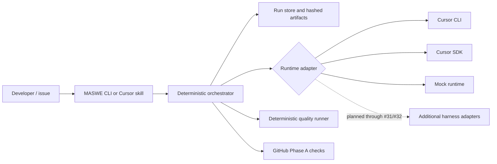

# Multi-Agent Software Engineer (MASWE)

A durable, model-configurable software-delivery orchestrator with deterministic workflow control, exact-head evidence, and independent verification.

MASWE separates product discovery, specification, implementation, verification, and pull-request resolution into distinct roles. A deterministic state machine owns transitions, while hashed artifacts preserve each handoff.

> **Implemented execution support:** Cursor CLI, optional Cursor SDK, and the deterministic mock runtime.
>
> **Approved direction:** multi-harness execution is governed by [Issue #31](https://github.com/tomazb/multi-agent-software-engineer/issues/31) and [Issue #32](https://github.com/tomazb/multi-agent-software-engineer/issues/32). Claude Code, Codex CLI, GitHub Copilot CLI, and OpenCode support is planned, not currently implemented.

## Workflow

```text
request
  -> brainstormer
  -> human approval
  -> specification/design agent
  -> human approval
  -> builder
  -> deterministic quality commands
  -> independent verifier
  -> PR review
  -> scoped resolver
  -> fresh quality and verification
  -> merge ready
```

Superpowers supplies engineering practices inside each stage. MASWE supplies durable orchestration, model routing, approvals, artifacts, retries, policy enforcement, and evidence binding.

## Architecture


```mermaid
flowchart LR
  U[Developer / issue] --> CLI[MASWE CLI or Cursor skill]
  CLI --> O[Deterministic orchestrator]
  O --> S[Run store and hashed artifacts]
  O --> R{Runtime adapter}
  R --> C[Cursor CLI]
  R --> SDK[Cursor SDK]
  R --> M[Mock runtime]
  R -. planned through #31/#32 .-> H[Additional harness adapters]
  O --> Q[Deterministic quality runner]
  O --> GH[GitHub Phase A checks]
```

The implemented architecture keeps the Cursor integration thin. MASWE, not a parent model, remains the source of truth. The dotted multi-harness path is approved roadmap scope rather than shipped behavior.

## Install

Requirements:

- Node.js `>=22.22.2 <23 || >=24.18.0 <25`;
- Git;
- Cursor CLI authentication for the current default runtime;
- Superpowers installed in Cursor for current Cursor-backed execution.

```bash
git clone https://github.com/tomazb/multi-agent-software-engineer.git
cd multi-agent-software-engineer
nvm install
nvm use
npm install
npm run check
npm run build
npm link
```

Exact Node `24.18.0` is the canonical contributor and primary-CI baseline. Exact Node `22.22.2` is the blocking compatibility floor. NVM is optional; any version manager may select a supported Node binary.

### Existing checkout after the rename

```bash
git remote set-url origin git@github.com:tomazb/multi-agent-software-engineer.git
git remote -v
git fetch origin --prune
```

Review external CI, Cursor Cloud projects, GitHub App allowlists, webhook deployments, bookmarks, and scripts that may store the former full repository name. Issue #34 tracks stable repository identity and rename reconciliation for persisted GitHub associations.

## Start a workflow

```bash
cd /path/to/your-project
maswe init
agent models
maswe doctor

maswe start \
  --title "Add organization audit trail" \
  --request-file docs/requests/organization-audit-trail.md
```

Inspect the generated artifact under `.maswe/runs/<run-id>/artifacts/`, then approve each requirement boundary explicitly:

```bash
maswe approve <run-id> brainstorm
maswe approve <run-id> design
```

A successful build, deterministic quality pass, and fresh verifier reaches `PR_READY`.

```bash
maswe pr-opened <run-id>
maswe review-comment <run-id> --text "Please add the missing expired-token case."
maswe merge-ready <run-id>
maswe complete <run-id>
```

Use `maswe status` or `maswe status <run-id> --json` at any time.

## Configuration

Current configuration precedence:

1. `--config <path>`
2. `.maswe/config.json`
3. `devflow.config.json`
4. built-in defaults

Implemented runtime kinds are `cursor-cli`, `cursor-sdk`, and `mock`. Do not configure Claude Code, Codex CLI, GitHub Copilot CLI, or OpenCode runtime kinds before their governed adapters are implemented.

Fallback models are attempted only when `policy.rejectModelFallback` is `false`. The default fail-closed policy uses only the configured primary model and rejects reported model mismatches.

## Current guarantees

- Centralized, explicit workflow transitions.
- Human approval gates after brainstorming and design.
- Hashed, attempt-specific artifacts.
- MASWE-owned isolated worktrees and deterministic commits.
- Trusted project quality commands outside model output.
- Independent read-only verification with strict terminal verdicts.
- Workspace fingerprinting around read-only roles.
- Exact-head quality, verification, and merge-readiness evidence.
- Bounded build/verify and review-resolution cycles.
- Secret-redacted, bounded runtime diagnostics.
- SHA-bound GitHub Phase A check publication.

## Current boundaries

- GitHub Phase A is read-only; PR creation, pushes, and comment replies remain Phase B.
- Local file state is not a distributed control plane.
- Cursor SDK support remains optional and experimental.
- External harness adapters and per-role harness routing are not implemented.
- Existing JSON Schema identifiers remain stable compatibility namespaces until a governed schema-version change.
- Stable GitHub identity across repository renames is tracked by Issue #34.

## Documentation

- [Product requirements](docs/PRD.md)
- [Architecture](docs/ARCHITECTURE.md)
- [Artifact contracts](docs/ARTIFACT_CONTRACTS.md)
- [Operations guide](docs/OPERATIONS.md)
- [Security model](docs/SECURITY.md)
- [GitHub App design](docs/GITHUB_APP.md)
- [Development guide](docs/DEVELOPMENT.md)
- [Roadmap](docs/ROADMAP.md)
- [Architecture decisions](docs/adr/)

## License

MIT. See [LICENSE](LICENSE).
