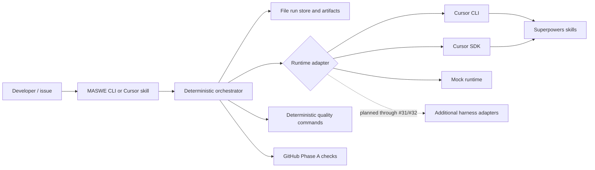

# Multi-Agent Software Engineer (MASWE)

A durable, model-configurable software-delivery orchestrator with deterministic workflow control, exact-head evidence, and independent verification.

The system separates product discovery, specification, implementation, independent verification, and pull-request comment resolution into distinct roles. A deterministic state machine owns stage transitions and file-based artifacts preserve every handoff.

> **Current execution support:** Cursor CLI, optional Cursor SDK, and the deterministic mock runtime.
>
> **Approved direction:** capability-negotiated multi-harness execution is governed by [Issue #31](https://github.com/tomazb/multi-agent-software-engineer/issues/31) and [MH-00 Issue #32](https://github.com/tomazb/multi-agent-software-engineer/issues/32). Claude Code, Codex CLI, GitHub Copilot CLI, and OpenCode support is planned, not currently implemented.

> Project status: **v0.2 local hardening + v0.3 Phase A read-only GitHub checks**. The local CLI includes atomic run storage, git worktree isolation, deterministic commits/scope checks, marker enforcement, secret redaction, stdin prompt transport, budgets/timeouts, retry/supersede recovery, and a governed Node runtime contract. A read-only GitHub App webhook/check publisher lives in `src/github/`. Push/PR writes, comment automation, multi-harness adapters, and the hosted control plane remain later milestones.

## Why this exists

Long agent conversations drift. Builders can overfit to their own implementation, model selection can silently change, and PR comments can broaden scope. This project makes the process explicit:

```text
request
  -> brainstormer
  -> human approval
  -> specification/design agent
  -> human approval
  -> builder
  -> deterministic CI
  -> independent verifier
  -> PR review
  -> scoped resolver
  -> deterministic CI
  -> fresh verifier
  -> merge ready
```

Superpowers supplies the engineering practices inside each stage. MASWE supplies durable orchestration, model routing, gates, artifacts, retries, and policy enforcement.

## Default roles

| Role | Preferred default | Permissions | Responsibility |
|---|---|---|---|
| Brainstormer | Grok 4.5 | Read-only | Product discovery, alternatives, risks, acceptance criteria |
| Designer | Claude Fable 5; Opus 4.8 fallback | Read-only | PRD-quality specification, architecture, test and implementation plan |
| Builder | Grok 4.5 | Workspace write | TDD-oriented implementation of the approved plan |
| Verifier | GPT-5.6 Sol High | Read-only | Independent evidence-based verification |
| PR resolver | GPT-5.6 Sol High | Scoped workspace write | Minimal resolution of in-scope review comments |

These defaults currently resolve through Cursor. Model identifiers in Cursor can change and may differ by plan. The starter config contains the intended defaults as initial slugs. Run `agent models` and `maswe doctor`, then adjust the exact values available to your account.

## Architecture at a glance


```mermaid
flowchart LR
  U[Developer / issue] --> CLI[MASWE CLI or Cursor skill]
  CLI --> O[Deterministic orchestrator]
  O --> S[File run store and artifacts]
  O --> R{Runtime adapter}
  R --> C[Cursor CLI]
  R --> SDK[Cursor SDK]
  R --> M[Mock runtime]
  R -. planned through #31/#32 .-> H[Additional harness adapters]
  O --> Q[Deterministic quality commands]
  C --> SP[Superpowers skills]
  SDK --> SP
  O --> GH[GitHub Phase A checks]
```

The implemented architecture deliberately keeps the Cursor plugin thin. The standalone orchestrator is the source of truth so a workflow can survive editor restarts, model failures, CI runs, and multi-day PR review.

## Quick start

### Prerequisites

- A Node.js runtime in the supported range `>=22.22.2 <23 || >=24.18.0 <25`.
  - Canonical contributor and primary-CI baseline: exact Node `24.18.0` from `.nvmrc`.
  - Blocking compatibility floor: exact Node `22.22.2`.
- Git.
- Cursor CLI installed and authenticated when using the current default runtime.
- Superpowers installed in Cursor with `/add-plugin superpowers` for current Cursor-backed execution.
- A clean target repository, unless `policy.allowDirtyWorkspace` is explicitly enabled.

Node 23, Node 25, Node 26+, Node 22 below `22.22.2`, and Node 24 below `24.18.0` are unsupported. Passing an ad hoc command on an unsupported runtime is exploratory evidence, not a supported configuration.

### Install and build

NVM is optional and is not a MASWE product dependency. When NVM is available, `.nvmrc` provides the canonical version:

```bash
git clone https://github.com/tomazb/multi-agent-software-engineer.git
cd multi-agent-software-engineer
nvm install
nvm use
npm install
npm run check
npm run build
npm link
```

With another version manager, container image, or system package, select any runtime inside the supported range before running npm commands. Normal installation, repository scripts, and the CLI fail early with `MASWE_UNSUPPORTED_NODE_VERSION` when the active runtime is outside the contract. The diagnostic reports the selected version, supported range, canonical `.nvmrc` baseline, and an optional NVM recovery example.

`npm link` makes the `maswe` command available globally for local development. A packaged release can replace this later.

### Existing checkout after the repository rename

```bash
git remote set-url origin git@github.com:tomazb/multi-agent-software-engineer.git
git remote -v
git fetch origin --prune
```

Also review external CI, Cursor Cloud projects, GitHub App allowlists, webhook deployments, bookmarks, and scripts that may store the former full repository name. Issue #34 tracks stable GitHub repository identity and rename reconciliation for persisted MASWE associations.

### Initialize a target repository

```bash
cd /path/to/your-project
maswe init
```

This creates `.maswe/config.json`. Edit its models and quality commands for the project, then validate the environment:

```bash
agent models
maswe doctor
```

### Start a feature

```bash
maswe start \
  --title "Add organization audit trail" \
  --request-file docs/requests/organization-audit-trail.md
```

The brainstormer runs and the workflow stops at the first approval gate. Inspect the generated artifact under `.maswe/runs/<run-id>/artifacts/`.

```bash
maswe approve <run-id> brainstorm
maswe approve <run-id> design
```

The second approval executes the builder, configured quality commands, and a fresh verifier. A successful run stops at `PR_READY`.

```bash
maswe pr-opened <run-id>
maswe review-comment <run-id> --text "Please add the missing expired-token case."
# In-scope changes return to PR_REVIEW after CI and fresh verification.
maswe merge-ready <run-id>
maswe complete <run-id>
```

Use `maswe status` or `maswe status <run-id> --json` at any time.

## Configuration

The CLI searches for configuration in this order:

1. `--config <path>`
2. `.maswe/config.json`
3. `devflow.config.json`
4. Built-in defaults

Environment overrides are available for automation:

```text
MASWE_RUNTIME
MASWE_MODEL_BRAINSTORMER
MASWE_MODEL_DESIGNER
MASWE_MODEL_BUILDER
MASWE_MODEL_VERIFIER
MASWE_MODEL_PR_RESOLVER
```

The currently implemented runtime kinds are:

- `cursor-cli`: default and immediately usable with the `agent` executable.
- `cursor-sdk`: local Cursor SDK execution; install `@cursor/sdk` and set `CURSOR_API_KEY`.
- `mock`: deterministic development and test runtime.

Do not configure Claude Code, Codex CLI, GitHub Copilot CLI, or OpenCode runtime kinds before their governed adapters are implemented.

Fallback models are attempted only when `policy.rejectModelFallback` is `false`. With the default fail-closed policy, a role runs only with its primary configured model and rejects a reported model mismatch.

## Safety and correctness guarantees

The current implementation provides:

- Explicit state transitions; invalid transitions fail closed.
- Separate human approval gates after brainstorming and design.
- Structured, hashed artifacts stored per run.
- Deterministic project quality commands outside the model.
- Independent verifier context and an exact `VERDICT: PASS|FAIL` contract.
- Read-only workspace fingerprinting around brainstorm, design, classification, and verification stages.
- Immutable per-run ticket journals with exact-target release and explicitly serialized recovery;
  no automatic age reclaim or recursive lock deletion.
- Configurable retry ceilings for build/verify and review-resolution loops.
- Scope classification before any PR comment is automatically resolved.
- Re-running quality checks and a fresh verifier after every resolver edit.
- Layered Node-runtime rejection through bounded package engines, strict npm engine policy, guarded repository scripts, and the CLI entry boundary before repository or durable-state actions.

The v0.2 verifier and quality gates bind evidence to the current git **head SHA**. Read-only roles still use workspace fingerprinting to detect unauthorized edits. Phase A mirrors that evidence into GitHub Checks via `maswe github-webhook` / `maswe github-publish-checks` when `githubApp` is enabled.

## Current limitations

- The local CLI creates isolated `maswe/<run-id>` branches/worktrees and deterministic commits by default. Pull request creation and Contents write from the GitHub App remain Phase B.
- GitHub App Phase A publishes read-only check runs; it does not push branches, open PRs, or reply to review comments yet.
- Human approvals are local commands rather than signed GitHub actions (GitHub comment/label approvals are Phase B).
- File-based state is suitable for one operator or CI job, not concurrent distributed workers.
- Lock journals require a coherent same-host local filesystem with atomic no-clobber hard links;
  they are not distributed locks or process fencing, and Windows support requires native NTFS
  qualification.
- GitHub Phase A supports one same-host webhook listener/worker plus simultaneous manual publishers
  through immutable hash-addressed journals. Startup recovers a file-synced normalized inbox before
  listen; legacy GitHub state requires a quiescent retained-path migration, and mixed old/new
  binaries are unsupported. GitHub HTTP calls use a 30-second per-request deadline.
- Model catalogue output differs across Cursor versions; for Cursor CLI, `maswe doctor` resolves logical names against exact catalogue IDs for its probe (without persisting a run snapshot) and fails closed on missing or ambiguous matches. `maswe start` persists resolved exact IDs into the new run config.
- The Cursor SDK is a public beta and is kept behind an adapter boundary.
- External harness adapters and capability-negotiated per-role routing are not implemented yet.
- JSON Schema `$id` values introduced before the repository rename remain stable compatibility identifiers until a separately governed schema-version change.

These are deliberate boundaries rather than hidden behavior. See [the roadmap](docs/ROADMAP.md).

## Documentation

- [Product requirements](docs/PRD.md)
- [Architecture](docs/ARCHITECTURE.md)
- [Artifact contracts](docs/ARTIFACT_CONTRACTS.md)
- [Operations guide](docs/OPERATIONS.md)
- [Security model](docs/SECURITY.md)
- [GitHub App design](docs/GITHUB_APP.md)
- [Development guide](docs/DEVELOPMENT.md)
- [Roadmap](docs/ROADMAP.md)
- [Architecture decisions](docs/adr/)

## Repository layout

```text
src/                 Orchestrator, state machine, store, runtimes, CLI
scripts/             Dependency-free repository policy guards
prompts/             Versioned role prompts and output contracts
test/                Node test-runner unit and workflow tests
skills/maswe/         Cursor plugin skill and references
.cursor-plugin/       Cursor plugin manifest
.cursor/rules/        Repository-level agent guardrails
docs/                 PRD, architecture, security, operations, roadmap, ADRs
examples/             Starter request and configuration examples
.github/               CI, issue templates, PR template, dependency updates
```

## Development

```bash
nvm install   # optional version-manager flow; reads .nvmrc
nvm use
npm install
npm run typecheck
npm test
npm run build
```

The test suite uses Node's built-in TypeScript stripping and test runner; the production build uses TypeScript. Exact-head evidence must record the Node binary path, `process.execPath`, Node version, and npm version, with Node 24 canonical and Node 22 compatibility results reported separately.

## License

MIT. See [LICENSE](LICENSE).
