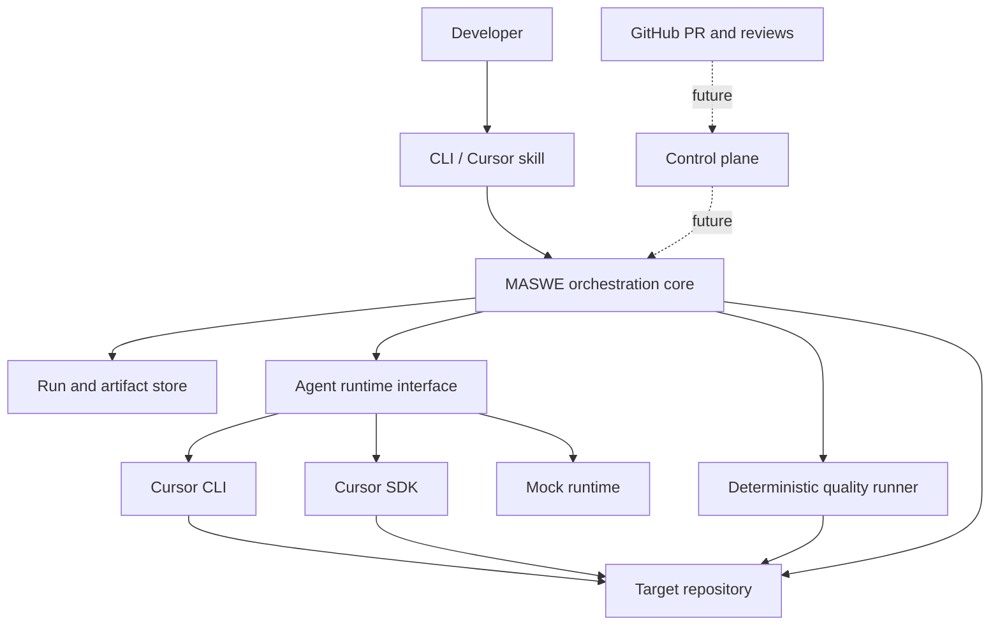
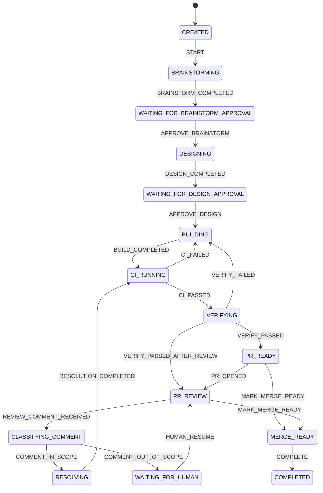
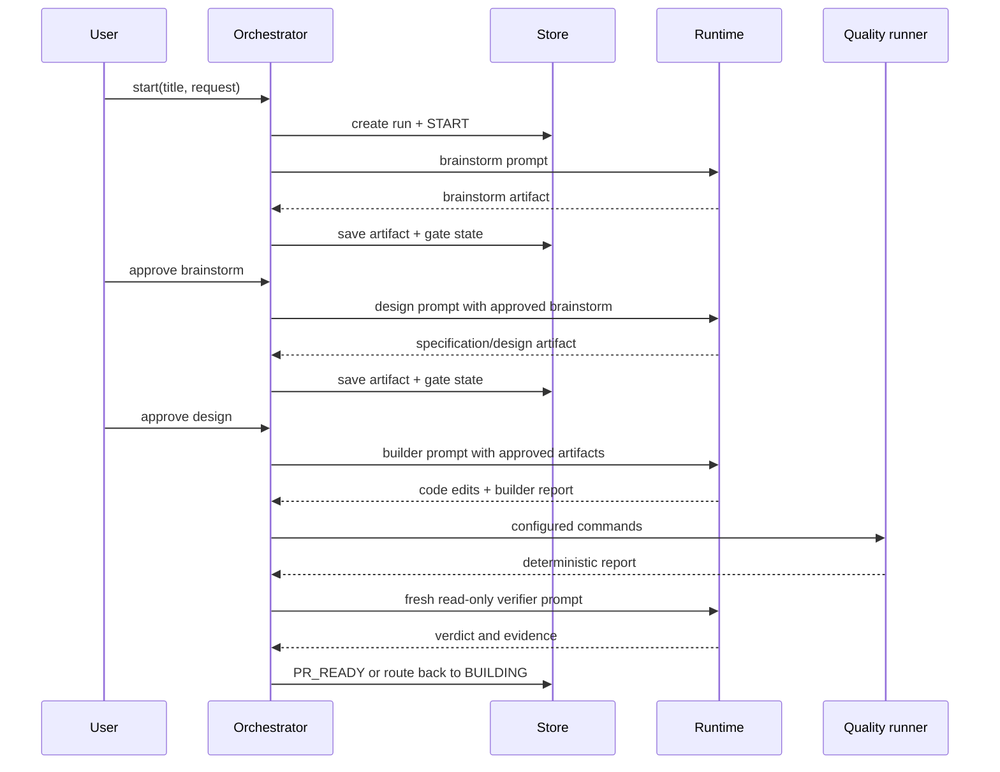

# Architecture

## 1. Decision summary

MASWE is an **orchestrator-first system with a thin Cursor plugin**.

- The orchestration core is authoritative for state, stage order, policy, artifacts, retries, and approvals.
- Cursor CLI and Cursor SDK are execution adapters.
- Superpowers defines how each role performs its assigned engineering work.
- Deterministic project commands decide test/build health.
- GitHub becomes the remote event and merge-control surface in a later milestone.

This prevents a single parent model from becoming an implicit, long-lived workflow engine.

## 2. System context



## 3. Logical components

### 3.1 CLI entry point

`src/cli.ts` parses commands, resolves the target repository and configuration, creates a runtime, invokes the orchestrator, and renders run state.

It contains no transition logic beyond selecting a public orchestrator operation.

### 3.2 Configuration loader

`src/config.ts` supplies safe defaults, loads project JSON, applies environment overrides, validates essential values, and returns an immutable configuration snapshot for each run.

The configuration snapshot prevents later project edits from silently changing an in-progress run.

### 3.3 Domain model

`src/domain.ts` contains role, runtime, configuration, state, event, artifact, run, quality, and adapter contracts.

These types are public architecture boundaries. A future API and database should preserve their semantics even when storage representations change.

### 3.4 State machine

`src/state-machine.ts` is the only place that maps workflow events to new states. Generic `FAIL` and `CANCEL` are allowed only for nonterminal states.



Any nonterminal state may transition to `FAILED` or `CANCELLED` through the generic events. Terminal states accept no further events.

### 3.5 Orchestrator

`src/orchestrator.ts` owns workflow behavior:

- Starts and advances runs.
- Builds prompts from approved artifacts.
- Selects roles and model candidates.
- Invokes runtime adapters.
- Enforces model mismatch and fallback policy.
- Writes stage artifacts.
- Runs quality checks.
- Parses verifier and scope-classification contracts.
- Enforces retry ceilings.
- Stops at human and integration gates.

It does not contain Cursor SDK implementation details, shell output parsing, or persistence internals.

### 3.6 Run and artifact store

`src/store.ts` persists each run below:

```text
.maswe/runs/<run-id>/
├── run.json
└── artifacts/
    ├── 02-brainstorm.md
    ├── 03-specification-and-design.md
    ├── 04-builder-report.md
    ├── 05-quality-report.md
    ├── 06-verification-report.md
    ├── 07-review-comment.md
    ├── 08-comment-classification.md
    └── 09-resolution-report.md
```

`run.json` is an event-bearing snapshot, not an event-sourced database. It stores enough history
for audit and recovery in a single-host local deployment. Mutating operations use the permanent
per-run `.lock-journal-v3/` ticket journal described below. `writeArtifact` still rejects stale
caller versions and only mutates authoritative on-disk state, so the lock change does not weaken
optimistic versions or atomic run/artifact publication.

Artifacts are SHA-256 hashed when written. A future store can place content in object storage and keep the same reference contract.

### 3.7 Prompt builder

`src/prompt-builder.ts` loads versioned templates from `prompts/`, injects the request and previously approved artifacts, and creates a self-contained stage prompt.

Prompts are implementation assets, not the workflow source of truth. A prompt cannot authorize a transition or bypass policy.

### 3.8 Runtime adapter interface

`AgentRuntime` defines two operations:

```ts
execute(request): Promise<RuntimeResult>
doctor(): Promise<RuntimeDoctorResult>
```

Implemented adapters:

- `MockRuntime`: deterministic outputs for tests and workflow development.
- `CursorCliRuntime`: invokes the Cursor `agent` command in print mode. **New runs** resolve logical model names via `resolveProjectModels` against a fail-closed structured catalogue parse; **existing-run stages** call `validatePersistedExactModel` and never substitute. Unwraps JSON/`stream-json` stdout using only terminal `type: "result"` events (text mode keeps raw stdout); never treats stderr as successful assistant content. Adds `--mode ask` for read-only roles and `--force` only for write roles; adds `--trust` when `policy.trustManagedWorktrees` is set for MASWE-managed worktrees. Doctor discovers the catalogue before the stdin probe and cleans probe branch/worktree by recorded probe identity in `finally`.
- `CursorSdkRuntime`: dynamically imports `@cursor/sdk` and runs a local one-shot `Agent.prompt` call (no catalogue capability; empty-catalogue pass-through stays SDK-only).

The optional SDK import means the CLI can build and run without installing the beta SDK.

### 3.9 Read-only enforcement

`src/git-snapshot.ts` computes a SHA-256 workspace fingerprint for both Git and non-Git working directories:

- **Git mode:** porcelain status including untracked files; unstaged binary diff; staged binary diff; paths and contents of untracked files. Git-plane probes always pathspec-exclude `.maswe/` (they do not rely on `.git/info/exclude`). Other paths still honor ordinary `--exclude-standard` policy.
- **Non-Git mode:** a stable namespace sentinel (not the invariant identity string) so the digest remains deterministic when nothing authoritative changes.
- **Both modes:** authoritative `.maswe` state under the fingerprinted `cwd`, hashed only through the MASWE-plane hasher: project config, `runs/*/run.json`, and durable artifact files.

Intentionally excluded from the MASWE portion (expected orchestration churn): `.lock`,
`.admin.lock`, `.admin.lock.recovering`, canonical protocol entries beneath exact
`runs/<run-id>/.lock-journal-v3/` paths, and ordinary `*.tmp` staging files. Unexpected or
malformed journal entries remain fingerprint-visible and also fail journal validation. The
journal exclusion is deliberately path-specific; a `.lock-journal-v3` name elsewhere under
`.maswe` remains fingerprinted. Isolated worktrees fingerprint their own `cwd` (typically without
a local `.maswe` store); non-isolated checkouts include the operator-tree `.maswe` so read-only
roles cannot mutate handoffs undetected. Workspace identity fields (`baseSha` / `headSha` /
`branch`) may still record `not-a-git-repository` for non-Git trees; that sentinel is separate
from the fingerprint digest.

Read-only runtimes compare the fingerprint before and after execution. Any difference fails the run. This is a mutation detector, not an operating-system sandbox. A future sandbox can prevent writes rather than merely detecting them.

### 3.10 Quality runner

`src/quality.ts` runs trusted project commands sequentially with the system shell. It records exit code, stdout, stderr, and duration. It stops after the first failure. Timeouts use `src/process.ts`, which terminates the shell process tree (POSIX process group / Windows `taskkill /T`) and bounds Promise settlement even if a descendant held pipes open.

Quality commands never come from model output, issue text, or PR comments.

## 4. Stage data flow



## 5. Model routing

Each role has:

- Primary model slug.
- Optional ordered fallback slugs.
- Reasoning effort metadata.
- Permission mode.

With `rejectModelFallback: true`, only the primary candidate is attempted. If a runtime reports an actual model different from the requested model, the run fails.

With `rejectModelFallback: false`, runtime or startup failure may advance through configured candidates. Every attempt remains visible in the failure message and successful event metadata.

Model aliases are project configuration for **new runs only**. For runtimes that implement catalogue discovery (`CursorCliRuntime` via `agent models`):

- **`start`:** discovers the catalogue, resolves logical role models to exact executable IDs (effort-aware: an explicit `-high`/`-medium`/`-low` suffix requires the same effort; otherwise fail closed), and **persists** those exact IDs in the new `run.config` snapshot.
- **`doctor`:** discovers the catalogue and resolves an exact ID for its stdin probe only. Doctor does **not** create a run and does **not** persist a `run.config` snapshot.
- **Existing-run stages:** validate the persisted exact ID against the live catalogue and never substitute same-core, same-family, provider, or effort variants when the catalogue drifts.

`CursorSdkRuntime` has no catalogue capability; doctor/start do not call `agent models`, and empty-catalogue pass-through keeps configured IDs as-is for SDK-only paths.

## 6. Superpowers integration

MASWE expects Superpowers to be installed in Cursor. Role prompts explicitly request these practices:

| Stage | Superpowers practices |
|---|---|
| Brainstorm | brainstorming |
| Design | writing-plans |
| Build | executing-plans, test-driven-development, verification-before-completion |
| Verify | requesting-code-review, verification-before-completion |
| PR resolve | receiving-code-review, test-driven-development, verification-before-completion |

MASWE does not fork or embed Superpowers. This keeps methodology upgrades independent from orchestration code.

## 7. Deployment modes

### 7.1 Local CLI — implemented

One process operates on one checkout. State lives under `.maswe/`. This is the v0.1 reference deployment.

### 7.2 CI runner — partially supported

The CLI can run in CI against an existing checkout. Approval and GitHub event wiring must currently be supplied by workflow steps or manual commands.

### 7.3 Hosted control plane — planned

A service will own durable runs and workers, use PostgreSQL, issue idempotent jobs, launch Cursor cloud or self-hosted agents, receive GitHub webhooks, and expose HTTP/MCP interfaces.

## 8. GitHub architecture — planned

The GitHub App will:

- Receive pull request, review, review comment/thread, push, and check events.
- De-duplicate deliveries by webhook delivery ID.
- Bind every verification result to the exact PR head SHA.
- Create separate check runs for specification compliance, independent verification, and comment resolution.
- Post evidence-based replies but resolve threads only after CI and verification pass.
- Use installation tokens with least-privilege repository permissions.

See `docs/GITHUB_APP.md`.

## 9. Consistency and concurrency

v0.2 uses optimistic `version` checks and atomic writes per run. Concurrent writers against the
same run still fail closed rather than merge updates.

### 9.1 Immutable local lock journals

Each run owns permanent, separately ordered `data`, `admin`, and `admin-recovery` streams:

```text
.lock-journal-v3/
├── format.json
├── data/{claims,releases,tmp}/
├── admin/{claims,releases,tmp}/
└── admin-recovery/{claims,releases,tmp}/
```

Infrastructure initialization creates each directory non-recursively and validates existing
components without following links. Directories are never ownership identities and conforming
code never deletes, replaces, or recursively removes them.

Claims use contiguous 20-digit `BigInt` tickets beginning at one. A claimant writes and syncs
canonical JSON to an exclusive temporary regular file, closes it, and hard-links it to the
deterministic claim path without clobbering. The owner is the smallest valid unreleased ticket.
Before protected work, the claimant validates every exact lower ticket/release path and rechecks
that its own canonical release is absent. Enumeration discovers state but is not proof that a
lower ticket is absent.

For valid claims, release, queued cancellation, and forced recovery all publish the same
deterministic immutable release marker for one exact kind, ticket, UUID, and claim digest. Forced
resolution of one eligible corrupt data/admin record instead uses `targetMode: "raw-claim"` bound
to the stable claim filename and exact raw-byte digest. Neither form deletes or edits a claim,
release, successor, or journal directory. The `admin-recovery` stream uses the same ordering and
has no recursively higher lock; a live recovery owner is never force-released.

Ticket zero is a read-only compatibility overlay for a PR #10 `.lock`, `.admin.lock`, or
`.admin.lock.recovering` object. A v3 resolution binds its exact raw digest and leaves the legacy
path untouched. New code never writes the legacy format, and mixed old/new active binaries are
unsupported.

The hosted design adds:

- Run version numbers.
- Compare-and-swap updates.
- Idempotency keys per event and stage attempt.
- Leases for workers.
- Transactional outbox for GitHub side effects.
- Immutable artifact versions.

## 10. Failure and retry model

Failures fall into categories:

1. **Startup/configuration:** missing CLI, key, SDK, model, or invalid config. The run fails immediately.
2. **Agent run failure:** nonzero CLI exit or SDK error. The configured fallback policy applies.
3. **Quality failure:** routes to `BUILDING` while under cycle limit.
4. **Verification failure:** routes to `BUILDING` while under cycle limit.
5. **Scope failure:** routes to `WAITING_FOR_HUMAN` without edits.
6. **Permission violation:** read-only fingerprint mismatch fails the run.
7. **Policy exhaustion:** cycle limit produces `FAILED`.

The orchestrator never retries indefinitely.

## 11. Trust boundaries

```text
trusted configuration
  -> may define shell quality commands and runtime command

untrusted request / model output / PR comments
  -> may influence prompts and artifacts
  -> may not define shell commands or transitions

runtime process
  -> can read repository
  -> write only for builder/resolver roles

GitHub input (future)
  -> authenticated webhook but still untrusted content
  -> must pass scope and policy checks
```

## 12. Known architecture gaps

- No structured telemetry exporter.
- SDK adapter uses a one-shot local prompt and does not yet exploit durable SDK agents.
- Reasoning effort is stored but not translated into provider-specific SDK parameters.
- GitHub App check runs and authenticated PR automation remain v0.3+.

Closed in v0.2: branch/worktree manager, git SHA persistence on the run record, atomic file-store writes with optimistic versioning, artifact digest revalidation, attempt history, secret redaction, stdin prompt transport, budgets/timeouts, and retry/supersede recovery.

## 13. Extension points

- Add a runtime by implementing `AgentRuntime` and extending `RuntimeKind` plus the factory.
- Add a store by implementing `RunStore` (see `FileRunStore`) before the first database implementation.
- Add a stage by changing domain constants, transition table, orchestrator behavior, prompts, artifact contracts, tests, and docs together.
- Add GitHub through an event adapter that calls public orchestrator operations; do not put webhook logic in the core.
- Add policy through deterministic functions that take configuration and run state; avoid prompt-only policy.
