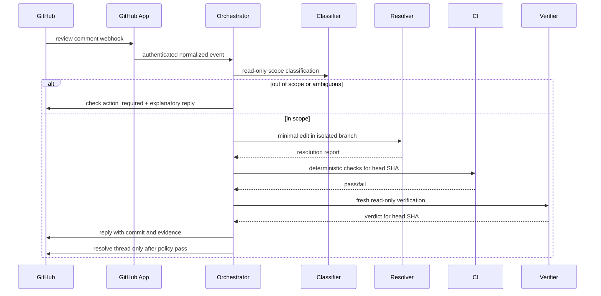

# GitHub App design

This document specifies the next production integration. It is not implemented in v0.1.

## Objectives

- Turn GitHub issues, pull requests, reviews, comments, pushes, and check results into authenticated workflow events.
- Publish transparent check runs bound to the current head SHA.
- Resolve only in-scope review comments after deterministic CI and fresh verification.
- Use least-privilege installation tokens and idempotent side effects.
- Keep GitHub-specific code outside the orchestration core.

## Proposed components

```text
apps/github-app/
  webhook HTTP endpoint
  signature verification
  event normalization
  authorization
  delivery deduplication
  check-run publisher
  review reply/thread adapter

apps/control-plane/
  workflow API
  durable queue/workers
  PostgreSQL store
  artifact object store
  runtime adapters

packages/github/
  typed GitHub event contracts
  installation-token client
  idempotent operations
```

## Repository permissions

Start with the minimum needed:

| Permission | Access | Purpose |
|---|---|---|
| Metadata | Read | Required by GitHub Apps |
| Contents | Read and write | Read repository and push a feature branch through deterministic publishing |
| Pull requests | Read and write | Read PR state, post replies, update branch metadata |
| Issues | Read and write | Optional issue intake and approval labels/comments |
| Checks | Read and write | Create and update MASWE check runs |
| Actions | Read | Observe workflow completion and artifacts |
| Commit statuses | Read | Consume existing CI status when needed |

Avoid administration, secrets, environments, deployments, and organization permissions in the initial release.

## Webhook events

Subscribe to:

- `pull_request`: opened, synchronize, reopened, closed, ready_for_review, converted_to_draft.
- `pull_request_review`: submitted, edited, dismissed.
- `pull_request_review_comment`: created, edited, deleted.
- `pull_request_review_thread`: resolved, unresolved where available.
- `issue_comment`: created for command/approval comments on PRs and issues.
- `push`: invalidate evidence on branch updates not represented by PR synchronize handling.
- `check_run` and `check_suite`: consume external CI results.
- `workflow_run`: consume GitHub Actions terminal status and artifacts when configured.
- `installation` and `installation_repositories`: maintain tenancy and repository access.

## Authentication and replay protection

1. Verify `X-Hub-Signature-256` against the raw request body.
2. Read `X-GitHub-Delivery` and store it under a unique constraint.
3. Reject timestamps outside an operational replay window where applicable.
4. Normalize the payload into an internal event before business logic.
5. Acquire an installation token only for the repository handling the event.
6. Record external request and response IDs without storing tokens.

## Internal event example

```json
{
  "eventId": "github-delivery-id",
  "type": "review_comment.created",
  "repository": "owner/repo",
  "installationId": 12345,
  "pullRequestNumber": 42,
  "headSha": "abc123",
  "commentId": 98765,
  "threadId": "PRRT_...",
  "author": "reviewer",
  "body": "Please cover the expired token case.",
  "receivedAt": "2026-07-22T12:00:00Z"
}
```

The review body is untrusted and never becomes a command.

## Check runs

Publish independent checks:

```text
MASWE / specification compliance
MASWE / deterministic quality
MASWE / independent verification
MASWE / review comments resolved
```

Every check run includes:

- Repository and PR.
- Head SHA.
- Run and attempt IDs.
- Requested and actual model when known.
- Links to approved artifacts.
- Summary of acceptance criteria and blocking findings.
- Conclusion: success, failure, neutral, cancelled, timed_out, or action_required.

A new head SHA invalidates all previous success conclusions. The app creates or updates checks only for the SHA that was actually evaluated.

## Approval model

Initial options, in increasing assurance:

1. Maintainer runs local `maswe approve` command.
2. Authorized user adds a configured label.
3. Authorized user comments `/maswe approve brainstorm <artifact-digest>`.
4. Web dashboard approval tied to GitHub identity and artifact digest.

Production should authorize users through repository permission or a configured team. The approval record must include actor, timestamp, artifact digest, and source event ID.

## Branch and worktree policy

- Use a dedicated branch `maswe/<run-id>-<slug>`.
- Builder executes in an isolated clone or worktree.
- Deterministic code, not the model, creates commits and pushes.
- Before push, verify the branch base and no disallowed files changed.
- Use optimistic checks to prevent overwriting reviewer or developer commits.
- On PR synchronize, determine whether the change came from MASWE or an external actor and invalidate/replan accordingly.

## Review-comment lifecycle



## Idempotency

Each side effect has a stable key:

```text
check-run: repository/pr/head-sha/check-name/attempt
comment-reply: review-comment-id/resolution-attempt
branch-push: run-id/source-sha/artifact-digest
thread-resolution: thread-id/verified-head-sha
```

Store the key and resulting GitHub resource ID transactionally before acknowledging completion. Retries reuse or reconcile the existing resource.

## Failure behavior

- Signature or authorization failure: reject without workflow changes.
- Duplicate delivery: return success without repeating side effects.
- GitHub rate limit: retry according to reset and backoff headers.
- Stale head SHA: cancel current attempt and restart classification/verification for the new SHA.
- Merge conflict: `WAITING_FOR_HUMAN` or a dedicated reconciliation stage.
- CI failure: builder/resolver correction loop under budget.
- Ambiguous review comment: `WAITING_FOR_HUMAN`.
- Permission change or installation removal: suspend runs and revoke leases.

## Rollout plan

1. Read-only GitHub App that posts check summaries but cannot push.
2. Enable branch creation/push for allowlisted repositories.
3. Enable PR comment classification with human-approved resolution.
4. Enable automatic in-scope resolution for low-risk categories.
5. Add thread resolution only after observed reliability targets are met.
6. Add issue-driven intake and approval commands.
