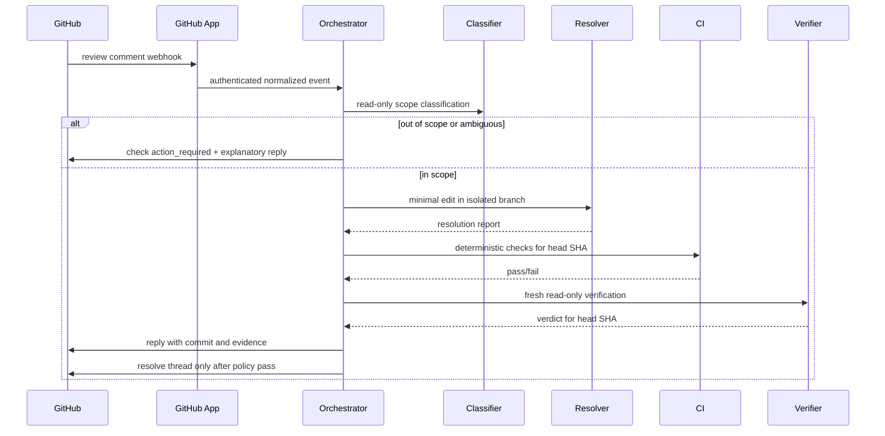

# GitHub App design

This document specifies the GitHub App integration. **Phase A (read-only checks)** is implemented in the single-package tree under `src/github/` (issue #3). The `apps/` / `packages/` layout below remains the **target** for the v0.4 control-plane split and is not required to run the Phase A pilot.

## Phase A status (implemented)

- CLI: `maswe github-webhook`, `maswe github-publish-checks <run-id>`
- Modules: `src/github/` (signature verify, delivery dedupe, normalize, association index, installation token helper, check publisher, adapter, webhook server)
- File-backed state under `.maswe/github/` (deliveries, side-effect idempotency keys, associations,
  and immutable ownership journals)
- Config: optional `githubApp` with `readOnlyChecks: true` required when enabled
- Check names: specification compliance, deterministic quality, independent verification, review comments resolved (always `neutral` in Phase A)
- Non-goals still deferred (Phase B / later): push, PR create/update, comment replies, digest-bound GitHub approvals, Actions artifact ingestion, Postgres control plane

## Objectives

- Turn GitHub issues, pull requests, reviews, comments, pushes, and check results into authenticated workflow events.
- Publish transparent check runs bound to the current head SHA.
- Resolve only in-scope review comments after deterministic CI and fresh verification.
- Use least-privilege installation tokens and idempotent side effects.
- Keep GitHub-specific code outside the orchestration core.

## Proposed components (v0.4+ target layout)

```text
apps/github-app/          # future extraction from src/github/
  webhook HTTP endpoint
  signature verification
  event normalization
  authorization
  delivery deduplication
  check-run publisher
  review reply/thread adapter

apps/control-plane/       # ROADMAP v0.4
  workflow API
  durable queue/workers
  PostgreSQL store
  artifact object store
  runtime adapters

packages/github/          # future shared library extraction
  typed GitHub event contracts
  installation-token client
  idempotent operations
```

Phase A equivalent paths today:

```text
src/github/
  webhook-server.ts
  signature.ts
  normalize.ts
  delivery-store.ts / side-effect-store.ts / association.ts
  checks.ts
  token.ts
  adapter.ts
```

## Phase A state and support boundary

Phase A supports concurrent webhook and manual-publisher processes on one host when
`.maswe/github/` is on one coherent local filesystem with atomic no-clobber hard links. It is not a
distributed lock. NFS, SMB, distributed FUSE, object-store mounts, cross-host access, and
filesystems without those hard-link semantics are unsupported.

Each logical association, check-create key, and delivery uses a permanent hash-addressed journal:

```text
.maswe/github/journals/
├── association/<sha256-logical-key>/.lock-journal-v3/
├── check-create/<sha256-logical-key>/.lock-journal-v3/
└── delivery/<sha256-logical-key>/.lock-journal-v3/
    ├── format.json
    ├── data/{claims,releases,tmp}/
    ├── admin/{claims,releases,tmp}/
    └── admin-recovery/{claims,releases,tmp}/
```

Claims and releases are canonical, digest-bound immutable files published with hard links. No
published ownership pathname is deleted, replaced, or reused. Before the webhook listener accepts
traffic or manual publication begins, initialization creates the root association journal and
runs the journal hard-link probe; failure is fatal.

Migration from the earlier association and check-create regular-file/directory locks requires a
quiescent upgrade: stop every old webhook and manual-publisher process, then start only the new
binary. Migration binds the exact legacy bytes or stable empty-directory identity in an immutable
marker and retains the old pathname. A live, malformed, or changing legacy owner fails closed.
Mixed old/new active binaries are unsupported, and operators must not delete retained paths or
journal records.

## Repository permissions

Phase A uses only the minimum read/check permissions needed by its implemented paths:

| Permission | Access | Purpose |
|---|---|---|
| Metadata | Read | Required by GitHub Apps |
| Contents | Read | Resolve repository/head state; Phase A refuses Contents writes |
| Pull requests | Read | Read PR identity and current head; Phase A refuses PR/comment writes |
| Checks | Read and write | Create and update MASWE check runs |
| Actions | Read | Observe workflow completion; artifact ingestion remains deferred |
| Commit statuses | Read | Consume existing CI status when needed |

Phase B may add Contents, pull-request, and Issues writes only with a separate feature gate and
permission review. Avoid administration, secrets, environments, deployments, and organization
permissions in the initial release.

## Webhook events

Subscribe to:

- `pull_request`: opened, synchronize, reopened, closed, ready_for_review, converted_to_draft.
- `pull_request_review`: submitted, edited, dismissed.
- `pull_request_review_comment`: created, edited, deleted.
- `pull_request_review_thread`: resolved, unresolved where available.
- `issue_comment`: created for command/approval comments on PRs and issues.
- `push`: invalidate evidence on branch updates not represented by PR synchronize handling.
- `check_run` and `check_suite`: consume external CI results.
- `workflow_run`: consume GitHub Actions terminal status and artifacts when configured.
- `installation` and `installation_repositories`: maintain tenancy and repository access.

## Authentication and replay protection

1. Verify `X-Hub-Signature-256` against the raw request body.
2. Read `X-GitHub-Delivery` and claim its lease-fenced ledger under the delivery's immutable
   journal.
3. Reject timestamps outside an operational replay window where applicable.
4. Normalize the payload into an internal event before business logic.
5. Acquire an installation token only for the repository handling the event.
6. Record external request and response IDs without storing tokens.

## Internal event example

```json
{
  "eventId": "github-delivery-id",
  "type": "review_comment.created",
  "repository": "owner/repo",
  "installationId": 12345,
  "pullRequestNumber": 42,
  "headSha": "abc123",
  "commentId": 98765,
  "threadId": "PRRT_...",
  "author": "reviewer",
  "body": "Please cover the expired token case.",
  "receivedAt": "2026-07-22T12:00:00Z"
}
```

The review body is untrusted and never becomes a command.

## Check runs

Publish independent checks:

```text
MASWE / specification compliance
MASWE / deterministic quality
MASWE / independent verification
MASWE / review comments resolved
```

Every check run includes:

- Repository and PR.
- Head SHA.
- Run and attempt IDs.
- Requested and actual model when known.
- Links to approved artifacts.
- Summary of acceptance criteria and blocking findings.
- Conclusion: success, failure, neutral, cancelled, timed_out, or action_required.

A new head SHA invalidates all previous success conclusions. The app creates or updates checks only for the SHA that was actually evaluated.

## Approval model

Initial options, in increasing assurance:

1. Maintainer runs local `maswe approve` command.
2. Authorized user adds a configured label.
3. Authorized user comments `/maswe approve brainstorm <artifact-digest>`.
4. Web dashboard approval tied to GitHub identity and artifact digest.

Production should authorize users through repository permission or a configured team. The approval record must include actor, timestamp, artifact digest, and source event ID.

## Branch and worktree policy

- Use a dedicated branch `maswe/<run-id>-<slug>`.
- Builder executes in an isolated clone or worktree.
- Deterministic code, not the model, creates commits and pushes.
- Before push, verify the branch base and no disallowed files changed.
- Use optimistic checks to prevent overwriting reviewer or developer commits.
- On PR synchronize, determine whether the change came from MASWE or an external actor and invalidate/replan accordingly.

## Review-comment lifecycle


```mermaid
sequenceDiagram
  participant GH as GitHub
  participant App as GitHub App
  participant O as Orchestrator
  participant C as Classifier
  participant R as Resolver
  participant CI as CI
  participant V as Verifier

  GH->>App: review comment webhook
  App->>O: authenticated normalized event
  O->>C: read-only scope classification
  alt out of scope or ambiguous
    O->>GH: check action_required + explanatory reply
  else in scope
    O->>R: minimal edit in isolated branch
    R-->>O: resolution report
    O->>CI: deterministic checks for head SHA
    CI-->>O: pass/fail
    O->>V: fresh read-only verification
    V-->>O: verdict for head SHA
    O->>GH: reply with commit and evidence
    O->>GH: resolve thread only after policy pass
  end
```

## Idempotency

Each side effect has a stable key:

```text
check-run: repository/pr/head-sha/check-name/attempt
comment-reply: review-comment-id/resolution-attempt
branch-push: run-id/source-sha/artifact-digest
thread-resolution: thread-id/verified-head-sha
```

For check runs, `external_id` is `maswe:check-run:sha256:<full-digest>` over the complete
repository/PR/head-SHA/check-name/attempt key. This avoids prefix-truncation collisions. Store the
key and resulting GitHub resource ID before acknowledging completion. If the local side-effect
record is missing after an ambiguous create, reconcile with `filter=all`, `per_page=100`, and
bounded pagination across every advertised page; patch a recovered check with the current outcome.

## Failure behavior

- Signature or authorization failure: reject without workflow changes.
- Delivery replay is state-sensitive: a `completed` duplicate returns HTTP 200 without repeating
  side effects, while a live `processing` duplicate returns retryable HTTP 503. A stale processing
  lease can be reclaimed after the crash TTL, but an expired lease cannot complete or fail its
  successor.
- Unsupported event/action classifications are completed as intentionally ignored and return HTTP
  200. Malformed or transient failures for supported events are not recorded as successful.
- Every claim, complete, fail, and recovery mutation runs inside the delivery's immutable journal.
  Completion staging is attempt- and lease-bound. Recovery installs a completed result only from
  one structurally valid compatible outcome; conflicts and lone staging without canonical state
  fail closed and preserve evidence.
- Before removing a failed processing canonical, the store publishes an immutable
  `deliveries/<delivery>.json.suppression.<publication-id>` audit marker bound to the failed lease,
  canonical digest, and exact retained artifact digests. These permanent markers prevent an old
  completed staging/reclaim pair from suppressing a later retry; malformed markers fail closed.
- Unhandled server failures are emitted through the local diagnostic callback and return only
  generic HTTP 500 JSON (`internal server error`). Diagnostic callback failure cannot change that
  response or leak environment-variable names/internal exception text. The existing HTTP 413 body
  limit remains.
- The default GitHub fetch client applies a 30-second deadline to each installation-token,
  live-head, Checks API, webhook-triggered, and manual-publication request. Rate-limit retries are
  bounded and every repeated request gets its own finite deadline.
- GitHub rate limit: retry according to reset and backoff headers.
- Stale head SHA: cancel current attempt and restart classification/verification for the new SHA. Live-head lookup failures fail closed (do not apply the event SHA).
- Exact PR identity: association matches only `github.com` remotes over HTTPS or SSH (`git@` / `ssh://git@…/`); plain HTTP and non-GitHub hosts are rejected.
- Concurrent check creates, association mutations, and delivery mutations use immutable ticket
  journals. Only the smallest valid unreleased ticket enters; ESRCH-proven dead lower claims may
  receive exact immutable releases. Live, malformed, ambiguous, or indeterminate owners block.
- Merge conflict: `WAITING_FOR_HUMAN` or a dedicated reconciliation stage.
- CI failure: builder/resolver correction loop under budget.
- Ambiguous review comment: `WAITING_FOR_HUMAN`.
- Permission change or installation removal: suspend every listed repository (including multi-repo `repositories_removed`) and reconcile run records even when the index was already suspended; run-save errors other than missing runs surface to the handler.

## Rollout plan

1. Read-only GitHub App that posts check summaries but cannot push.
2. Enable branch creation/push for allowlisted repositories.
3. Enable PR comment classification with human-approved resolution.
4. Enable automatic in-scope resolution for low-risk categories.
5. Add thread resolution only after observed reliability targets are met.
6. Add issue-driven intake and approval commands.
