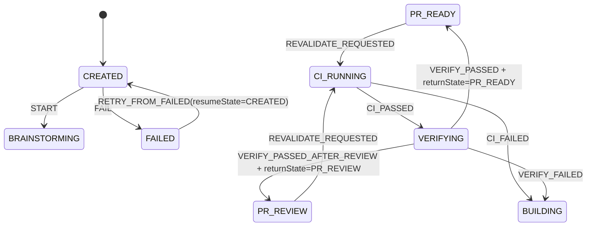

# Issue #28 Workflow Provenance, Recovery, and Revalidation Design

## Status

- **Issue:** [#28 — Harden workflow provenance, durable recovery, and stale-evidence revalidation](https://github.com/tomazb/multi-agent-software-engineer/issues/28)
- **Parent:** [#27 — Correctness hardening: workflow provenance, recovery, and policy boundaries](https://github.com/tomazb/multi-agent-software-engineer/issues/27)
- **Design status:** Owner-approved direction, published for exact-artifact review
- **Implementation status:** Not authorized by this document
- **Date:** 2026-08-18
- **Exact design baseline:** `e80043cb208b5c26671a7aae34283d75ffab9dec`
- **Design branch:** `issue-28-workflow-recovery`

This document specifies one coherent repair slice for Issue #28. It does not authorize implementation until the repository owner approves this exact committed artifact and a subsequent implementation plan.

## 1. Decision summary

MASWE will repair Issue #28 with narrow additions to the existing schema-version-1 run contract and the existing optimistic file-store architecture. The design does not add a database transaction API, a second state machine, or new persisted workflow states.

The repair has five coordinated parts:

1. Builder and resolver events bind public `headSha` to the evaluated post-publication SHA.
2. The automatic-advance bound checks the resulting state before reporting overflow and publishes overflow through the normal durable failure path.
3. `CREATED` becomes an idempotent bootstrap state backed by a persisted workspace-bootstrap intent.
4. Retry stages the restored workspace, retry event, cleared active failure, and retained `previousFailure` audit data in one run-record publication.
5. `PR_READY` and `PR_REVIEW` gain an explicit `REVALIDATE_REQUESTED` route through `CI_RUNNING` and `VERIFYING`, with durable return context.

The implementation will continue to use:

- `src/state-machine.ts` as the only transition map;
- MASWE-owned branch, worktree, commit, evidence, and publication authority;
- exact SHA-bound quality and verification evidence;
- schema version `1` with optional backward-compatible fields;
- one-host file-store optimistic concurrency and durable atomic replacement;
- deterministic failure-injection seams and authoritative reload assertions.

## 2. Context and confirmed defects

Issue #28 groups five defects that share one invariant: a run must never claim a state, recovery path, or evaluated code identity that is not durably and exactly represented in its authoritative record.

### 2.1 Incorrect evaluated SHA in editing events

`BUILD_COMPLETED` and `RESOLUTION_COMPLETED` currently record the pre-publication SHA in both `inputHeadSha` and public `headSha`, even when MASWE subsequently creates a deterministic commit and records a different `outputHeadSha`.

This makes the public event provenance ambiguous: downstream consumers can interpret `headSha` as the evaluated output while it actually identifies the input.

### 2.2 Non-durable and off-by-one automatic-advance bound

`runUntilBlocked()` currently throws after the loop when the iteration counter reaches 20. It therefore:

- leaves a run durably stored in an automatic state while the CLI reports failure; and
- reports overflow when the final allowed advance legitimately lands on a human gate or terminal state.

### 2.3 Unrecoverable partial `CREATED` initialization

Run creation is durable before branch/worktree establishment and before the `START` event. A failure in that interval can leave a `CREATED` record with partial Git resources. A later `maswe run` routes through generic failure, records `resumeState: CREATED`, and then cannot retry because `CREATED` is not resumable.

The current `workingDirectoryFor()` fallback also makes an absent managed worktree dangerous: an isolated run must never treat the operator checkout as an implicit substitute.

### 2.4 Retry can destroy its only durable retry key

`retryFromFailed()` currently deletes `run.failure`, restores and saves the workspace, and only then publishes `RETRY_FROM_FAILED`. A failure in the final publication can leave a durable `FAILED` record without `failure.resumeState`, making the next retry impossible.

### 2.5 Human-gate evidence invalidation has no legal re-entry path

Local workspace synchronization and GitHub head observation can remove stale evidence while the workflow remains at `PR_READY` or `PR_REVIEW`. `runUntilBlocked()` stops at those human gates, and no event returns the run to `CI_RUNNING`.

The return state after successful verification cannot be inferred only from `commentResolutionCycles`: an external head change can occur in `PR_REVIEW` before MASWE has resolved any comment.

## 3. Goals

The implementation must provide all of the following:

- exact, unambiguous input/output/evaluated SHA provenance;
- a durable automatic-advance overflow failure with a stable code;
- correct behavior when the allowed boundary lands on a gate or terminal state;
- idempotent recovery from each partial `CREATED` bootstrap boundary;
- no implicit execution in the operator checkout for an isolated run;
- retry publication that leaves either the original retryable failure or the complete resumed record;
- one explicit revalidation event and one shared revalidation semantic for local and GitHub head movement;
- correct return to `PR_READY` or `PR_REVIEW` after fresh quality and verification;
- fail-closed merge-ready and completion checks while evidence is absent, stale, or revalidation is pending;
- schema-version-1 compatibility without rewriting historical event SHAs.

## 4. Non-goals

This issue does not include:

- a general state-machine redesign;
- PostgreSQL, distributed workers, leases, or a transactional outbox;
- automatic fetch, merge, rebase, reset, force-update, PR creation, or merge;
- a new CLI grammar or broad command-surface redesign;
- policy-violation and untrusted-input hardening owned by Issue #29;
- terminal-worktree cleanup recovery owned by Issue #30;
- repository-rename identity migration owned by Issue #34;
- GitHub Phase B write authority;
- unrelated dependency, package, workflow, or runtime-adapter changes.

## 5. Governing invariants

### I28-INV-01 — One transition authority

Only `src/state-machine.ts` maps events to workflow states. Bootstrap, retry, local synchronization, and GitHub integration may request events but may not assign workflow states directly.

### I28-INV-02 — Exact evaluated identity

Every quality, verification, merge-ready, completion, and GitHub check conclusion is bound to the exact SHA it evaluated. Editing-stage public `headSha` identifies the output/evaluated state, not the input.

### I28-INV-03 — No operator-checkout substitution

When `run.config.policy.useIsolatedWorktree` is true, role execution, quality commands, verification, and recovery require the exact MASWE-managed worktree recorded or deterministically reconstructed for that run. Absence is an error, not permission to use `run.repositoryPath`.

### I28-INV-04 — Old or complete publication

A recovery publication must leave either:

- the prior authoritative record, still actionable under its prior operation; or
- the complete next authoritative record, including its state, event, workspace identity, and audit fields.

Intermediate durable records that remove the only recovery key are forbidden.

### I28-INV-05 — External observations do not become authority by themselves

A GitHub head observation can request revalidation and bind the GitHub association to the observed head. It cannot claim that the local managed workspace contains that head. Quality and verification run only when local and required external identity constraints are satisfied.

### I28-INV-06 — Historical events are immutable evidence

Migration may add optional current-state metadata or validate new invariants. It must not rewrite existing event details, input SHAs, output SHAs, or event ordering.

### I28-INV-07 — No unrecoverable intermediate workflow state

The design adds metadata, not new persisted workflow states. Every persisted active or failed state retains a documented operator operation.

## 6. Alternatives considered

### 6.1 Selected: staged run snapshots plus narrow recovery metadata

Use optional `workspaceBootstrap` and `revalidation` metadata, clone the authoritative run before multi-field transitions, and publish through the existing `RunStore.save()` or `RunStore.applyEvent()` optimistic write.

Advantages:

- smallest coherent repair;
- preserves current file-store and schema-version contracts;
- supports deterministic fault injection;
- does not pre-empt the future PostgreSQL transaction model;
- keeps state transitions centralized.

### 6.2 Rejected: generic file-store transaction or mutation API

A generic `RunStore.transaction()` or `mutate()` API could express the changes, but it would broaden the local store contract before Issue #4 defines the hosted consistency model. Issue #28 needs coherent run-record publication, not a general database abstraction.

### 6.3 Rejected: `BOOTSTRAPPING` and `REVALIDATING` workflow states

Dedicated states would make the graph more descriptive but would enlarge every state/event/schema/documentation surface and risk introducing states with no distinct operator action. Optional metadata on existing actionable states is sufficient.

### 6.4 Rejected: infer review return solely from counters

`commentResolutionCycles > 0` cannot prove that the current validation cycle originated in `PR_REVIEW`. The design records the source gate explicitly.

### 6.5 Rejected: silently recapture or reset a conflicting workspace

If a persisted branch, worktree registration, path, or SHA conflicts with the run record, MASWE fails closed. It does not move refs, delete paths, prune registrations, or replace the operator checkout to make recovery appear successful.

## 7. Domain-model additions

All additions are optional schema-version-1 fields.

### 7.1 Workspace bootstrap intent

```ts
export interface WorkspaceBootstrapIntent {
  mode: "operator-checkout" | "isolated-worktree";
  sourceBaseSha: string;
  sourceBranch: string;
  sourceFingerprint: string;
  remote?: string;
  plannedAt: string;
}
```

`RunRecord` gains:

```ts
workspaceBootstrap?: WorkspaceBootstrapIntent;
```

The target managed branch and worktree path remain deterministic functions of the run ID:

```text
branch       = maswe/{run-id}
worktreePath = externalWorktreePath(repositoryPath, runId)
```

They are not duplicated in the bootstrap intent.

The field has three meaningful shapes:

| Run shape | Meaning |
|---|---|
| `CREATED` + bootstrap intent + no workspace | Workspace is planned but not durably established. |
| `CREATED` + bootstrap intent + workspace | Workspace is durably established; `START` is not yet published. |
| `FAILED` + `failure.resumeState: CREATED` + bootstrap intent | Bootstrap failed and is retryable from the exact intent. |

After a successful `START` publication, `workspaceBootstrap` is removed in the same run-record write as the event.

### 7.2 Revalidation context

```ts
export type RevalidationReturnState = "PR_READY" | "PR_REVIEW";
export type RevalidationSource = "local-workspace" | "github";

export interface RunRevalidation {
  returnState: RevalidationReturnState;
  source: RevalidationSource;
  previousHeadSha: string;
  requestedHeadSha: string;
  requestedAt: string;
}
```

`RunRecord` gains:

```ts
revalidation?: RunRevalidation;
```

`requestedHeadSha` records the head that triggered revalidation. A corrective builder loop may create a later SHA; final evidence remains bound to the actual evaluated SHA. `returnState` remains stable throughout the quality/build/verification loop.

The context is cleared in the same publication as the successful verification event that returns to the recorded gate.

### 7.3 Failure code

`RunFailureCode` gains:

```text
automatic-transition-limit-exceeded
```

The code is persisted in `run.failure.code` and `FAIL.details.code`, and is rendered explicitly for operators. Historical failures without a code remain valid.

### 7.4 Workflow event

`WorkflowEventType` gains:

```text
REVALIDATE_REQUESTED
```

No other new workflow event is required.

## 8. State-machine changes

The centralized transition table gains:

```text
PR_READY  + REVALIDATE_REQUESTED -> CI_RUNNING
PR_REVIEW + REVALIDATE_REQUESTED -> CI_RUNNING
```

`CREATED` is added to the resumable-state allowlist for `RETRY_FROM_FAILED`.

The resulting relevant graph is:



The generic `FAIL` and `CANCEL` rules remain unchanged. No handler may bypass these transitions by assigning `run.state`.

## 9. Exact editing-stage provenance

### 9.1 Builder

`BUILD_COMPLETED.details` uses:

```ts
{
  inputHeadSha: beforeSha,
  outputHeadSha: evaluatedSha,
  headSha: evaluatedSha
}
```

For an editing builder:

```text
inputHeadSha != outputHeadSha
headSha == outputHeadSha == run.workspace.headSha
```

For a no-op builder:

```text
inputHeadSha == outputHeadSha == headSha == run.workspace.headSha
```

### 9.2 Resolver

`RESOLUTION_COMPLETED.details` follows the identical contract.

### 9.3 Non-Git workspaces

The existing `not-a-git-repository` sentinel remains the coherent evaluated identity where the current architecture supports non-Git operation. The event fields must not disagree with `run.workspace.headSha`.

### 9.4 Historical compatibility

Existing events retain their original details. Migration does not reinterpret or rewrite the old public `headSha`. Documentation states the corrected contract applies to newly published events after this repair.

## 10. Idempotent `CREATED` bootstrap

### 10.1 Start sequence

`start()` performs the following ordered operations:

1. Validate dirty-workspace policy.
2. Discover models and resolve the immutable run configuration snapshot.
3. Capture the read-only source workspace identity immediately before run creation.
4. Create the `CREATED` run with `workspaceBootstrap` included in the initial authoritative record.
5. Invoke `runUntilBlocked(run.id)`.

The source capture occurs before the initial run write so a newly created run never lacks the exact intent needed to recover its first workspace.

`RunStore.create()` may receive an optional initial-record argument containing `workspaceBootstrap`; existing callers that do not supply it retain their current behavior for tests and controlled fixtures.

### 10.2 `advance(CREATED)`

`advance()` gains a `CREATED` case:

1. Validate or reconstruct the intended workspace using `workspaceBootstrap`.
2. Stage the established `run.workspace` on a cloned record.
3. Remove `workspaceBootstrap` from that clone.
4. Publish `START` on the clone through `RunStore.applyEvent()`.

If the workspace was already saved while the state remained `CREATED`, the method verifies it and proceeds directly to the coherent `START` publication.

### 10.3 Exact isolated-worktree reconciliation

For `mode: isolated-worktree`, recovery derives the expected branch and path from the run ID and classifies exact Git state.

#### Branch rules

| Observation | Result |
|---|---|
| Expected branch absent | Create it at `sourceBaseSha`. |
| Branch exists at `sourceBaseSha` | Reuse it. |
| Branch exists at another SHA | Fail closed; do not move the ref. |
| Branch identity cannot be read | Fail closed with a bounded exact diagnostic. |

#### Worktree rules

| Observation | Result |
|---|---|
| Expected path and registration absent | Add the expected branch at the deterministic path. |
| Registration exists at expected path, branch, and SHA | Reuse it. |
| Path exists as the exact registered worktree with expected identity | Reuse it. |
| Branch is checked out at another path | Fail closed. |
| Expected path contains unrelated or unregistered content | Fail closed. |
| Registration, path, branch, or HEAD disagrees | Fail closed. |
| A stale registration would require prune/removal | Fail closed; Issue #28 does not authorize repository cleanup. |

Classification uses structured Git inspection such as `git worktree list --porcelain` and exact ref resolution. Recovery must not rely only on matching localized Git stderr such as “already exists.”

### 10.4 Operator-checkout mode

For `mode: operator-checkout`, recovery verifies that the current repository still matches the captured source base, branch, and authoritative fingerprint before assigning `run.workspace`.

If it changed, bootstrap fails closed. The run does not silently start against a different checkout state.

### 10.5 Legacy `CREATED` records

Schema-version-1 records created before this repair can lack `workspaceBootstrap`.

Recovery rules are:

- If an exact persisted `run.workspace` exists, validate it and synthesize the minimum in-memory bootstrap intent needed to publish `START` without changing historical events.
- If neither the deterministic branch nor worktree exists, the operator may retry initial bootstrap from a freshly captured current source; the resulting intent is persisted before any branch/worktree side effect.
- If partial deterministic resources exist but no exact source base can be proven, fail closed with an operator action to supersede or recover the exact Git resources manually.

The implementation must never guess the base of an existing partial branch or worktree.

### 10.6 Working-directory guard

`workingDirectoryFor(run)` changes from a silent fallback to an invariant check:

```text
if isolated-worktree policy is true and run.workspace.worktreePath is absent:
    throw an exact managed-workspace-not-established error
```

The operator checkout remains valid only when isolated-worktree policy is false.

## 11. Durable automatic-advance bound

### 11.1 Boundary semantics

The default bound remains 20 automatic `advance()` operations per `runUntilBlocked()` invocation.

After each successful automatic advance:

1. increment the advance count;
2. return immediately if the resulting state is terminal or a human gate;
3. if the count has reached the bound and the resulting state is still automatic, publish the overflow failure.

Therefore:

- advance 20 landing on a human gate succeeds;
- advance 20 landing on a terminal state succeeds;
- needing another automatic advance after 20 produces `FAILED`.

Human or integration events published before `runUntilBlocked()` are not counted in that invocation.

### 11.2 Durable overflow publication

Overflow calls the normal failure path with:

```text
code: automatic-transition-limit-exceeded
resumeState: CURRENT_AUTOMATIC_STATE
```

The authoritative record contains the failure, `FAIL` event, and `FAILED` state. The CLI does not merely throw while leaving the run automatic.

### 11.3 Test seam

The production constant remains 20. A constructor or internal dependency seam may supply a smaller bound for deterministic focused tests. The seam is not project configuration, is not persisted, and does not change the public product policy.

## 12. Coherent failure publication

`failRun()` stages failure metadata and the `FAIL` event on a cloned run rather than saving `run.failure` separately before the event.

Conceptually:

```ts
const candidate = structuredClone(run);
candidate.failure = makeFailure(...);
const failed = await store.applyEvent(candidate, "FAIL", "orchestrator", details);
```

This reduces the authoritative outcomes to:

- the prior nonterminal record if publication did not occur; or
- the complete `FAILED` record with failure metadata and event.

Outcome-unknown durable writes are classified by reloading the authoritative record. In-memory mutation is never treated as proof of publication.

Terminal cleanup remains after terminal-state persistence and remains governed by Issue #30.

## 13. Coherent retry publication

### 13.1 Required sequence

`retryFromFailed()` performs:

1. Load the authoritative `FAILED` record.
2. Require `failure.resumeState` and copy the complete bounded/redacted failure as `previousFailure`.
3. Clone the run.
4. Reconcile the intended workspace on the clone:
   - `CREATED` uses `workspaceBootstrap` recovery;
   - later isolated states use the persisted branch/head/worktree identity;
   - operator-checkout states verify the current checkout identity.
5. Remove the active `candidate.failure` only in memory.
6. Publish `RETRY_FROM_FAILED` on the candidate with `resumeState` and `previousFailure`.
7. Continue through `runUntilBlocked()` only after authoritative publication succeeds.

No standalone save occurs while the durable state is still `FAILED`.

### 13.2 Publication failure semantics

If workspace reconciliation fails, the authoritative `FAILED` record is unchanged.

If retry-event publication fails before replacement, the authoritative record remains the original retryable `FAILED` record with `failure.resumeState` intact.

If the durable write outcome is unknown, reload and classify:

- exact retry event and resumed state present: adopt the authoritative resumed record;
- prior `FAILED` record present: report the publication failure while preserving retryability;
- any other record: fail closed as an inconsistent authoritative outcome.

### 13.3 Audit preservation

`RETRY_FROM_FAILED.details.previousFailure` continues to use the existing bounded and redacted contract. The retry does not delete or rewrite the earlier `FAIL` event.

## 14. Shared stale-evidence revalidation

### 14.1 Core operation

Introduce one public core operation, named during implementation according to existing conventions, with semantics equivalent to:

```ts
requestRevalidation(run, {
  source,
  previousHeadSha,
  requestedHeadSha,
  actor
})
```

The operation:

1. requires source state `PR_READY` or `PR_REVIEW`;
2. derives `returnState` from the actual source state;
3. invalidates stale `quality`, `verification`, and `mergeReady` evidence;
4. stores `run.revalidation`;
5. publishes `REVALIDATE_REQUESTED` to `CI_RUNNING`.

Local workspace observation and the GitHub adapter call this same operation. They do not implement separate return-state logic.

### 14.2 Local head movement

`runUntilBlocked()` performs a human-gate preflight before deciding to stop.

For `PR_READY` or `PR_REVIEW`:

1. inspect the exact managed workspace branch and HEAD;
2. compare the observed HEAD with the previously recorded workspace HEAD;
3. determine whether required quality and verification bindings are present for the observed HEAD;
4. if the head moved or required bindings are absent/stale, update the workspace identity on a candidate and request revalidation;
5. continue automatically through `CI_RUNNING` and `VERIFYING`.

A repeated `maswe run` with a fresh gate and current evidence remains a no-op.

### 14.3 GitHub head movement

The GitHub adapter continues to authenticate, normalize, deduplicate, live-head-check, and association-fence the event.

When an associated run at `PR_READY` or `PR_REVIEW` observes a different live PR head, the adapter transaction:

1. updates the GitHub association and pending old-head cancellation set;
2. delegates stale-evidence invalidation and state routing to the core revalidation operation;
3. binds the updated association index;
4. registers the existing run-record rollback behavior if the association transaction fails;
5. publishes neutral/current-head checks according to Phase A behavior.

The webhook path requests revalidation but does not invoke provider work. A later operator or runner invocation executes `maswe run`.

### 14.4 Local/GitHub head alignment

For a GitHub-associated revalidation, quality and verification may run only when:

```text
run.workspace.headSha == run.github.headSha
```

after exact local workspace synchronization.

Issue #28 does not authorize MASWE to fetch, reset, rebase, merge, or force-update the managed branch. If the identities differ, execution fails closed with recoverable `CI_RUNNING` provenance and no fresh success evidence.

On retry, an exact branch move to the persisted GitHub revalidation target may be accepted only when all of the following hold:

- the run is already in a GitHub-requested revalidation cycle;
- the branch is the exact recorded MASWE branch;
- the branch now resolves to the persisted requested GitHub head;
- the deterministic worktree registration and path still match;
- no unrelated path or registration conflict exists.

No other branch movement is accepted.

### 14.5 Successful return

During `VERIFYING`, success-event selection follows:

```text
if run.revalidation.returnState == PR_READY:
    VERIFY_PASSED
else if run.revalidation.returnState == PR_REVIEW:
    VERIFY_PASSED_AFTER_REVIEW
else:
    preserve the existing non-revalidation selection behavior
```

The successful event, fresh verification evidence, target gate, and removal of `run.revalidation` are published coherently.

The revalidation context remains present through:

- `CI_FAILED -> BUILDING`;
- `VERIFY_FAILED -> BUILDING`;
- retry from a failure in `BUILDING`, `CI_RUNNING`, or `VERIFYING`.

This allows corrective builder commits while preserving the correct final gate.

### 14.6 Idempotency

The core operation rejects `REVALIDATE_REQUESTED` outside `PR_READY` and `PR_REVIEW` through the state machine.

Duplicate GitHub delivery IDs remain governed by the existing durable inbox. Repeated local `maswe run` calls after the state has moved to `CI_RUNNING` continue the existing cycle rather than publishing a second revalidation request.

## 15. Merge-ready and completion gates

`markMergeReady()` and `complete()` must reject when any of these are true:

- `run.revalidation` is present;
- current workspace HEAD is unknown or differs from required GitHub head for an associated run;
- quality evidence is absent or not bound to the exact current HEAD;
- verification evidence is absent or not bound to the exact current HEAD;
- required evidence has `passed: false`;
- merge-ready evidence is absent or stale where completion requires it;
- the exact managed worktree is dirty or its branch identity differs.

These checks apply regardless of whether stale evidence was discovered locally or through GitHub.

The operations never recreate success from historical events after current evidence has been invalidated.

## 16. Store and consistency behavior

### 16.1 Existing primitives remain authoritative

The design uses the current:

- optimistic `version` check;
- per-run immutable lock journal;
- durable atomic run-record replacement;
- `RunStore.applyEvent()` transition validation;
- outcome-unknown reconciliation by authoritative reload.

No generic transaction API is added.

### 16.2 Clone-before-publication rule

Any operation that changes multiple authoritative concerns before one transition uses a cloned candidate. The caller’s loaded record is not mutated into an unrecoverable shape before the publication succeeds.

This applies to:

- `START` publication after workspace establishment;
- `FAIL` publication;
- `RETRY_FROM_FAILED` publication;
- revalidation request publication;
- successful verification that clears revalidation context.

### 16.3 Association transaction integration

The GitHub adapter retains its existing association journal and rollback model. The adapter records the pre-mutation run, delegates the state mutation to the core operation, and registers rollback against the exact attempted run version if the association transaction later fails.

A rollback must never rewrite immutable workflow history from a concurrently advanced run; existing version fencing remains mandatory.

## 17. Migration and compatibility

### 17.1 Schema version

`schemaVersion` remains `1`.

New optional fields:

```text
workspaceBootstrap
revalidation
```

New accepted failure code:

```text
automatic-transition-limit-exceeded
```

New event value:

```text
REVALIDATE_REQUESTED
```

### 17.2 Exact validation

Synchronize:

- `src/domain.ts`;
- `src/run-record-validation.ts`;
- `src/store.ts` field allowlists and migration;
- `schemas/run-record.schema.json`;
- schema and migration regression tests.

Both metadata objects use `additionalProperties: false` in JSON Schema and exact-key validation in TypeScript.

### 17.3 Historical records

Existing valid schema-version-1 records remain loadable.

- Historical events are not rewritten.
- Historical failures without `code` remain valid.
- Historical non-`CREATED` runs need no bootstrap metadata.
- Historical `CREATED` runs use the conservative recovery rules in Section 10.5.
- Historical gate records with current evidence remain valid.
- Historical gate records with absent or stale evidence request revalidation on the next public run/head-observation operation.

### 17.4 Fail-closed new invariants

A record fails closed when new metadata is present but malformed, internally contradictory, or incompatible with exact Git identity. Compatibility does not require accepting a record that claims two conflicting authoritative workspaces or return gates.

## 18. Rendering and operator behavior

Human-readable status adds:

- stable failure code when present;
- bootstrap status for `CREATED` or bootstrap-failed runs;
- revalidation source, requested head, and return gate while active;
- exact managed-workspace diagnostics where recovery is blocked.

JSON output naturally includes the new optional fields.

Messages remain bounded and redacted through existing diagnostics. Git stderr and path details are included only to the extent needed to identify the exact conflicting branch/worktree and do not include credentials or raw provider output.

No new CLI command is required. Existing operations remain:

```text
maswe run {run-id}
maswe retry {run-id}
maswe merge-ready {run-id}
maswe complete {run-id}
```

## 19. Documentation changes

Implementation must synchronize externally observable behavior in:

- `docs/PRD.md` — durable recovery, exact automatic bound, and revalidation requirements;
- `docs/ARCHITECTURE.md` — state graph, bootstrap publication, retry consistency, and revalidation data flow;
- `docs/ARTIFACT_CONTRACTS.md` — corrected event SHA meaning and new run metadata;
- `docs/GITHUB_APP.md` — core revalidation request on live-head movement and local/GitHub alignment;
- `docs/OPERATIONS.md` — bootstrap/retry diagnostics and operator recovery procedure;
- `schemas/run-record.schema.json` — exact machine contract.

No active documentation may imply that invalidating evidence alone is sufficient to resume a human-gated run.

## 20. Test architecture

All recovery claims require reloading the authoritative run record from disk after injected failure. In-memory assertions alone are insufficient.

### 20.1 Deterministic seams

The implementation may add narrow test-only seams for:

- automatic-advance bound;
- before branch creation;
- after branch creation;
- after worktree creation;
- after workspace save / before `START` publication;
- run-record save and event-publication failure;
- durable write outcome unknown;
- GitHub association transaction rollback;
- local head observation before revalidation.

Seams do not alter production defaults or become configuration.

### 20.2 Provenance tests

Cover:

- editing builder;
- no-op builder;
- editing resolver;
- no-op resolver;
- Git and supported non-Git sentinel behavior;
- quality and verification bound to the same final workspace SHA.

### 20.3 Automatic-bound tests

Cover:

- final allowed advance reaching a human gate;
- final allowed advance reaching a terminal state;
- one more required automatic advance producing durable `FAILED`;
- stable failure code;
- valid `failure.resumeState`;
- authoritative reload after failure.

### 20.4 Bootstrap tests

Inject failure:

1. before branch creation;
2. after branch creation but before worktree registration;
3. after worktree creation but before workspace save;
4. after workspace save but before `START`.

For every case:

- reload the run;
- verify exact partial Git state;
- retry;
- prove the intended branch/worktree is reconstructed or reused;
- prove the operator checkout is never selected;
- prove role execution begins only after coherent `START` publication.

Also cover conflicting branch SHA, alternate worktree registration, occupied path, stale registration, non-isolated checkout drift, and legacy `CREATED` classification.

### 20.5 Retry publication tests

Inject failure during retry publication and prove by authoritative reload that either:

- state remains `FAILED` with the original `failure.resumeState` and failure metadata; or
- the exact `RETRY_FROM_FAILED` event, restored workspace identity, cleared active failure, and resumed state are all present.

Cover ordinary pre-publication failure, optimistic version conflict, and durable outcome unknown.

### 20.6 Revalidation tests

Cover:

- local movement from `PR_READY` returning to `PR_READY`;
- local movement from `PR_REVIEW` returning to `PR_REVIEW`;
- GitHub movement from both gates;
- GitHub movement in `PR_REVIEW` with zero comment-resolution cycles;
- missing/stale evidence without another head change;
- CI failure, corrective build, and successful return;
- verifier failure, corrective build, and successful return;
- local/GitHub head mismatch;
- duplicate webhook and repeated local invocation;
- merge-ready and completion rejection while revalidation is pending;
- fresh GitHub checks bound only to the evaluated current head.

### 20.7 Contract tests

Cover:

- exact schema acceptance and rejection;
- TypeScript/schema enum synchronization;
- rendering of failure and revalidation context;
- old schema-version-1 records;
- no historical event mutation;
- package-content stability.

## 21. Acceptance-criteria traceability

| ID | Issue #28 acceptance criterion | Primary evidence |
|---|---|---|
| I28-AC-01 | Editing builder: `headSha === outputHeadSha === workspace.headSha`, input differs | Editing builder provenance regression |
| I28-AC-02 | Editing resolver has the same contract | New editing resolver regression |
| I28-AC-03 | No-op build/resolution records a coherent evaluated SHA | No-op builder and resolver regressions |
| I28-AC-04 | Automatic valve durably records `FAILED` with stable code and recovery metadata | Bound-overflow store-reload regression |
| I28-AC-05 | Exact boundary reaching human gate is accepted | Deterministic boundary test |
| I28-AC-06 | Exact boundary reaching terminal state is accepted | Deterministic boundary test |
| I28-AC-07 | Failure before branch creation is recoverable | Bootstrap barrier test 1 |
| I28-AC-08 | Failure after branch creation is recoverable | Bootstrap barrier test 2 |
| I28-AC-09 | Failure after worktree creation is recoverable | Bootstrap barrier test 3 |
| I28-AC-10 | Failure after workspace save / before `START` is recoverable | Bootstrap barrier test 4 |
| I28-AC-11 | Retried bootstrap reconstructs intended workspace before role execution | Retry plus runtime-cwd assertion |
| I28-AC-12 | Retry publication failure preserves retryable `FAILED` metadata | Store-reload publication-failure matrix |
| I28-AC-13 | Revalidation from `PR_READY` returns to `PR_READY` | Local and GitHub integration tests |
| I28-AC-14 | Revalidation from `PR_REVIEW` returns to `PR_REVIEW` | Local and GitHub integration tests |
| I28-AC-15 | External head movement before comment cycles returns to review | Zero-cycle GitHub regression |
| I28-AC-16 | Stale evidence cannot authorize merge-ready or completion | Gate rejection regressions |
| I28-AC-17 | Types, schema, rendering, artifact, architecture, and PRD agree | Schema/docs synchronization review and tests |
| I28-AC-18 | Required commands pass on both Node baselines | Exact-head CI and local validation evidence |

## 22. Expected implementation scope

Expected production files include:

```text
src/domain.ts
src/state-machine.ts
src/orchestrator.ts
src/git-workspace.ts
src/store.ts
src/run-record-validation.ts
src/run-rendering.ts
src/github/adapter.ts
schemas/run-record.schema.json
```

A focused helper such as `src/revalidation.ts` or `src/workspace-bootstrap.ts` is permitted when it keeps exact classification and tests isolated. It must not become a second transition authority.

Expected tests include focused Issue #28 suites plus updates to existing provenance, evidence, schema, retry, and GitHub integration tests.

Expected documentation files are listed in Section 19.

Explicitly excluded:

```text
src/config.ts
schemas/config.schema.json
src/prompt-builder.ts
src/cli-runner.ts parser redesign
src/runtimes/**
package.json
package-lock.json
.github/workflows/**
```

An excluded file may change only if implementation proves an unavoidable direct contract dependency and the owner approves the scope amendment before publication.

## 23. Implementation ordering

After approval of this design, the implementation plan will order work as follows:

1. Add red provenance regressions and correct builder/resolver event SHA semantics.
2. Add red boundary tests and implement durable automatic-limit failure.
3. Add bootstrap domain/schema contract and exact Git reconciliation tests.
4. Implement idempotent `CREATED` bootstrap and working-directory guard.
5. Add retry-publication failure tests and implement clone-staged retry.
6. Add revalidation domain/event/transition tests.
7. Implement shared local/GitHub revalidation routing and gate checks.
8. Synchronize rendering, schema, docs, and migration tests.
9. Run exact supported-baseline validation and independent exact-head review.

Every behavioral task is test-first. No implementation batch may weaken fail-closed behavior to satisfy a test.

## 24. Validation and merge gates

The implementation PR must pass on the exact supported baselines:

```text
Node 24.18.0 — canonical contributor and primary-CI baseline
Node 22.22.2 — blocking compatibility floor
```

Required commands:

```bash
npm run check
npm run pack:dry
git diff --check
```

Required governance evidence:

- branch based on the approved Issue #28 implementation baseline;
- exact-head CI success;
- regression coverage for every I28 acceptance criterion;
- independent exact-head review;
- no unresolved actionable review threads;
- clean scope audit with no Issue #29, #30, or unrelated changes;
- post-merge `main` revalidation before Issue #29 begins.

## 25. Risks and mitigations

### Risk: bootstrap reconciliation deletes or adopts unrelated Git state

Mitigation: exact branch SHA, structured worktree registration, deterministic path, and fail-closed conflict behavior. No prune, reset, force, or recursive deletion.

### Risk: optional metadata creates hidden state outside the workflow graph

Mitigation: metadata never maps events to states. Every transition remains in `src/state-machine.ts`, and metadata has explicit lifecycle and operator behavior.

### Risk: retry workspace side effects occur before run-record publication

Mitigation: side effects are idempotent and exact. Publication failure leaves the old `FAILED` record retryable; the next retry reclassifies and reuses the exact resources.

### Risk: GitHub head observation is mistaken for local code identity

Mitigation: separate `run.github.headSha` and `run.workspace.headSha`, require alignment before CI/verification, and prohibit automatic ref movement in this issue.

### Risk: revalidation context survives too long

Mitigation: context is cleared coherently only after successful verification. It intentionally survives correction loops and retry; merge-ready and completion reject while it exists.

### Risk: boundary tests depend on incidental workflow length

Mitigation: use a deterministic internal bound seam while preserving production default 20.

## 26. Resolved design decisions

The following choices are final for this design:

- use optional metadata, not new workflow states;
- retain schema version `1`;
- use `REVALIDATE_REQUESTED` as the single new event;
- derive revalidation return state from the actual source gate;
- retain existing counter-based success selection only when no revalidation context exists;
- treat `CREATED` as resumable;
- persist bootstrap intent in the initial run record before branch/worktree side effects;
- derive target branch and worktree path from run ID;
- stage failure and retry on cloned records;
- do not add a new CLI command;
- do not automatically fetch, reset, rebase, move, prune, or delete Git resources;
- keep terminal cleanup recovery in Issue #30.

## 27. Spec self-review

The committed specification must satisfy these checks before being offered for owner review:

- no unresolved marker, placeholder token, or open design decision;
- no contradiction between state transitions and lifecycle metadata;
- no implementation authorization before the design and plan gates;
- every Issue #28 acceptance criterion mapped to deterministic evidence;
- no accidental Issue #29 or Issue #30 scope;
- exact baseline and branch recorded;
- historical schema-version-1 and event compatibility stated explicitly.
